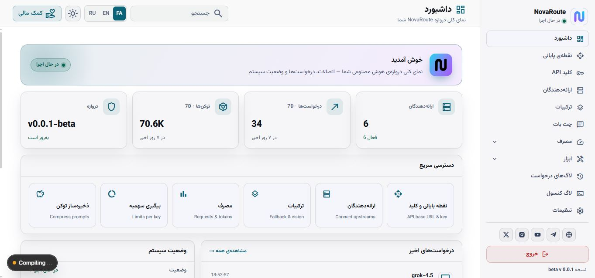
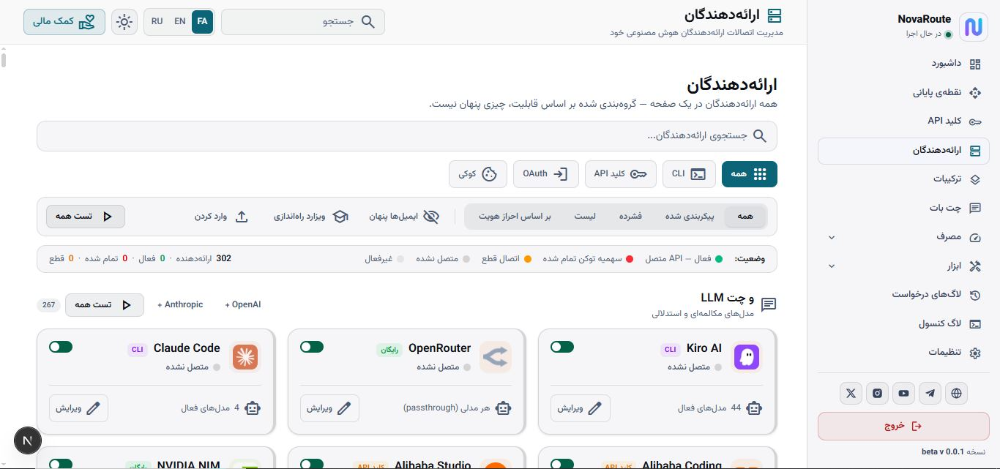

<div dir="rtl" align="center">

# 🔥 NovaRoute — دروازه هوش مصنوعی پیشرفته

**کامل‌ترین دروازه هوش مصنوعی متن‌باز. ۳۶۹+ پروایدر، ۶۰+ مسیر API، پروتکل A2A، بازی‌سازی و بیشتر.**

[](LICENSE)
[](https://github.com/IRNova/NovaRoute)
[](https://github.com/IRNova/NovaRoute)

</div>

---

## 🔗 شبکه‌های اجتماعی

<div align="center">

[](https://github.com/IRNova/NovaRoute)
[](https://discord.gg/novaroute)
[](https://t.me/novaroute)
[](https://twitter.com/NovaRoute)

</div>

---

## 📸 تصاویر

<div align="center">
  
  <p><em>داشبورد — مرکز کنترل دروازه AI</em></p>

  
  <p><em>مدیریت پروایدرها — ۳۶۹+ پروایدر</em></p>
</div>

---

## ⚡ نصب سریع

```bash
curl -fsSL https://raw.githubusercontent.com/IRNova/NovaRoute/main/install.sh | sudo bash
```

باز کن: `http://<ip سرور>:20126/dashboard`

---

## 📊 خلاصه امکانات

| دسته‌بندی | تعداد | توضیح |
|----------|:-----:|-------|
| 🔌 پروایدرها | **۳۶۹+** | OpenAI, Anthropic, Google, Mistral و ۳۶۵+ بیشتر |
| 📄 صفحات داشبورد | **۶۶** | رابط کاربری کامل وب |
| 🔗 مسیرهای API | **۶۰** | API RESTful برای هر قابلیت |
| 🧠 مهارت‌ها | **۱۲** | چت، تصویر، ویدیو، TTS، STT، Embeddings، MCP و غیره |
| 🌍 زبان‌ها | **۸** | فارسی، انگلیسی، چینی، ژاپنی، کره‌ای، عربی، ویتنامی، پرتغالی |
| 🧪 تست‌های E2E | **۱۱۲+** | تست‌های Playwright برای همه قابلیت‌ها |
| 🛡️ حفاظت | **۶** | تشخیص تزریق پرامپت، ماسک PII، ماسک credential |
| 🔄 مقاومت | **۴** | Circuit Breaker تطبیقی، طبقه‌بندی خطا |
| 🎯 مسیریابی ترکیبی | **۱۹** | استراتژی‌ها: fusion, pipeline, cost-optimized, P2C و غیره |
| 🎮 بازی‌سازی | **۳۰+** | نشان‌ها، XP، رکوردها، جدول امتیازات |
| 📋 انطباق | **۴** | ثبت ممیزی، موتور سیاست |
| 🔐 امنیت | **۴** | محدودسازی نرخ، مسدودسازی IP |
| 📊 مانیتورینگ | **۳** | متریک‌ها، بررسی سلامت، هشدارها |
| 🎭 مهندسی هرج و مرج | **۸** | ۸ نوع آزمایش |
| 🤖 رهبر ناوگان | **۱** | ارکستریشن ناوگان |
| 🎤 صدا | **۲** | TTS/STT + تماس صوتی WebRTC |
| 🧠 حافظه | **۲** | فروشگاه برداری + ارائه‌دهنده Embedding |
| 📱 کانال‌ها | **۴** | WhatsApp, Telegram, Slack, Discord |
| 🔌 بازارچه پلاگین | **۱۶** | ۱۶ پلاگین داخلی |
| 🤝 پروتکل A2A | **۶** | ارتباط agent-to-agent |
| 🔑 کلیدهای مجازی | **۱** | کلیدهای هر کاربر با ردیابی هزینه |
| 🐍 SDK پایتون | **۱** | نصب با pip |
| 🖥️ ابزار CLI | **۱** | مدیریت سرور از ترمینال |

---

## 🏆 جدول مقایسه — NovaRoute در مقابل رقبا

> ✅ = موجود و کارآمد | ⚠️ = جزئی/پایه | ❌ = موجود نیست

### 📡 امکانات اصلی

| قابلیت | NovaRoute 🔥 | OmniRoute 🟠 | Hermes 🟡 | OpenClaw 🟢 | 9Router 🔵 |
|--------|:-----------:|:-----------:|:---------:|:----------:|:---------:|
| **متن‌باز** | ✅ MIT | ✅ MIT | ❌ بسته | ✅ MIT | ✅ MIT |
| **زبان** | JS/TS | TypeScript | TypeScript | Ruby/TS | TypeScript |
| **خودمیزبانی** | ✅ | ✅ | ❌ | ✅ | ✅ |
| **داشبورد وب** | ✅ ۶۶ صفحه | ✅ ~۸۰ صفحه | ✅ | ✅ رابط وب | ✅ |
| **API** | ✅ ۶۰ مسیر | ✅ ~۷۰ مسیر | ✅ | ✅ | ✅ |
| **Docker** | ✅ | ✅ | ❌ | ✅ | ✅ |

### 🔌 پروایدرها و مدل‌ها

| قابلیت | NovaRoute 🔥 | OmniRoute 🟠 | Hermes 🟡 | OpenClaw 🟢 | 9Router 🔵 |
|--------|:-----------:|:-----------:|:---------:|:----------:|:---------:|
| **تعداد پروایدرها** | **۳۶۹** | **۳۶۹** | **~۳۰** | **~۵۰** | **~۲۰** |
| **OpenAI** | ✅ | ✅ | ✅ | ✅ | ✅ |
| **Anthropic** | ✅ | ✅ | ✅ | ✅ | ✅ |
| **Google Gemini** | ✅ | ✅ | ✅ | ✅ | ✅ |
| **پروایدرهای رایگان** | ✅ ۵۰+ | ✅ ۵۰+ | ✅ | ❌ | ❌ |
| **Ollama محلی** | ✅ | ✅ | ✅ | ✅ | ✅ |
| **کشف مدل‌ها** | ✅ | ✅ | ✅ | ❌ | ❌ |

### 🧠 قابلیت‌های هوش مصنوعی

| قابلیت | NovaRoute 🔥 | OmniRoute 🟠 | Hermes 🟡 | OpenClaw 🟢 | 9Router 🔵 |
|--------|:-----------:|:-----------:|:---------:|:----------:|:---------:|
| **چت/تکمیل** | ✅ | ✅ | ✅ | ✅ | ✅ |
| **استریمینگ (SSE)** | ✅ | ✅ | ✅ | ✅ | ✅ |
| **تولید تصویر** | ✅ | ✅ | ❌ | ❌ | ❌ |
| **تبدیل متن به صدا** | ✅ | ✅ | ❌ | ❌ | ❌ |
| **تبدیل صدا به متن** | ✅ | ✅ | ❌ | ❌ | ❌ |
| **真爱dings** | ✅ | ✅ | ✅ | ❌ | ❌ |
| **تولید ویدیو** | ✅ | ❌ | ❌ | ❌ | ❌ |
| **جستجوی وب** | ✅ | ✅ | ❌ | ❌ | ❌ |
| **ابزارهای MCP** | ✅ | ✅ | ❌ | ❌ | ❌ |
| **فراخوانی تابع** | ✅ | ✅ | ✅ | ✅ | ❌ |

### 🎯 مسیریابی هوشمند

| قابلیت | NovaRoute 🔥 | OmniRoute 🟠 | Hermes 🟡 | OpenClaw 🟢 | 9Router 🔵 |
|--------|:-----------:|:-----------:|:---------:|:----------:|:---------:|
| **مسیریاب هوشمند** | ✅ | ✅ | ❌ | ❌ | ❌ |
| **استراتژی‌های ترکیبی** | **۱۹** | **۱۹** | ❌ | ❌ | ❌ |
| **مسیریاب خودکار (AI)** | ✅ | ✅ | ❌ | ❌ | ❌ |
| **ترکیبی (Fan-out)** | ✅ | ✅ | ❌ | ❌ | ❌ |
| **بهینه‌سازی هزینه** | ✅ | ✅ | ❌ | ❌ | ❌ |
| **بارگذاری متعادل** | ✅ | ✅ | ✅ | ❌ | ❌ |

### 🤝 پروتکل A2A (ارتباط عامل با عامل)

| قابلیت | NovaRoute 🔥 | OmniRoute 🟠 | Hermes 🟡 | OpenClaw 🟢 | 9Router 🔵 |
|--------|:-----------:|:-----------:|:---------:|:----------:|:---------:|
| **سرور A2A** | ✅ | ✅ | ❌ | ❌ | ❌ |
| **کشف کارت عامل** | ✅ | ✅ | ❌ | ❌ | ❌ |
| **JSON-RPC 2.0** | ✅ | ✅ | ❌ | ❌ | ❌ |
| **استریمینگ SSE** | ✅ | ✅ | ❌ | ❌ | ❌ |
| **۶ مهارت** | ✅ | ✅ ۶ | ❌ | ❌ | ❌ |

### 🛡️ امنیت و حفاظت

| قابلیت | NovaRoute 🔥 | OmniRoute 🟠 | Hermes 🟡 | OpenClaw 🟢 | 9Router 🔵 |
|--------|:-----------:|:-----------:|:---------:|:----------:|:---------:|
| **سیستم حفاظت** | ✅ | ✅ | ❌ | ❌ | ❌ |
| **تشخیص تزریق پرامپت** | ✅ ۲۰+ الگو | ✅ | ❌ | ❌ | ❌ |
| **ماسک PII** | ✅ | ✅ | ❌ | ❌ | ❌ |
| **محدودسازی نرخ** | ✅ | ✅ | ✅ | ❌ | ❌ |
| **مسدودسازی IP** | ✅ | ✅ | ❌ | ❌ | ❌ |
| **احراز هویت SAML** | ✅ | ❌ | ❌ | ❌ | ❌ |
| **کلیدهای مجازی** | ✅ | ✅ | ❌ | ❌ | ❌ |

### 🔄 مقاومت و قابلیت اطمینان

| قابلیت | NovaRoute 🔥 | OmniRoute 🟠 | Hermes 🟡 | OpenClaw 🟢 | 9Router 🔵 |
|--------|:-----------:|:-----------:|:---------:|:----------:|:---------:|
| **شکننده مدار** | ✅ تطبیقی | ✅ تطبیقی | ❌ | ❌ | ❌ |
| **طبقه‌بندی خطا** | ✅ ۱۰ نوع | ✅ | ❌ | ❌ | ❌ |
| **قفل مدل** | ✅ | ✅ | ❌ | ❌ | ❌ |
| **منطق تلاش مجدد** | ✅ | ✅ | ✅ | ✅ | ❌ |
| **مدل‌های جایگزین** | ✅ | ✅ | ✅ | ❌ | ❌ |

### 🎭 سیستم‌های پیشرفته

| قابلیت | NovaRoute 🔥 | OmniRoute 🟠 | Hermes 🟡 | OpenClaw 🟢 | 9Router 🔵 |
|--------|:-----------:|:-----------:|:---------:|:----------:|:---------:|
| **مهندسی هرج و مرج** | ✅ ۸ آزمایش | ✅ | ❌ | ❌ | ❌ |
| **رهبر ناوگان** | ✅ | ✅ | ❌ | ❌ | ❌ |
| **انطباق و ممیزی** | ✅ | ✅ | ❌ | ❌ | ❌ |
| **مانیتورینگ** | ✅ | ✅ | ❌ | ❌ | ❌ |
| **بازارچه پلاگین** | ✅ ۱۶ داخلی | ✅ | ❌ | ❌ | ✅ |

### 🎮 بازی‌سازی و تجربه کاربری

| قابلیت | NovaRoute 🔥 | OmniRoute 🟠 | Hermes 🟡 | OpenClaw 🟢 | 9Router 🔵 |
|--------|:-----------:|:-----------:|:---------:|:----------:|:---------:|
| **سیستم نشان** | ✅ ۳۰+ نشان | ✅ | ❌ | ❌ | ❌ |
| **سیستم XP** | ✅ ۲۰ سطح | ✅ | ❌ | ❌ | ❌ |
| **سیستم رکورد** | ✅ | ✅ | ❌ | ❌ | ❌ |
| **جدول امتیازات** | ✅ | ✅ | ❌ | ❌ | ❌ |
| **گوگل آنالیتیکس** | ✅ | ❌ | ❌ | ❌ | ❌ |

### 📱 کانال‌ها و یکپارچه‌سازی‌ها

| قابلیت | NovaRoute 🔥 | OmniRoute 🟠 | Hermes 🟡 | OpenClaw 🟢 | 9Router 🔵 |
|--------|:-----------:|:-----------:|:---------:|:----------:|:---------:|
| **WhatsApp** | ✅ | ❌ | ❌ | ❌ | ❌ |
| **Telegram** | ✅ | ✅ واقعی | ❌ | ❌ | ❌ |
| **Slack** | ✅ | ❌ | ❌ | ❌ | ❌ |
| **Discord** | ✅ | ❌ | ❌ | ✅ | ❌ |

### 🎤 صدا و حافظه

| قابلیت | NovaRoute 🔥 | OmniRoute 🟠 | Hermes 🟡 | OpenClaw 🟢 | 9Router 🔵 |
|--------|:-----------:|:-----------:|:---------:|:----------:|:---------:|
| **تبدیل متن به صدا** | ✅ | ✅ | ❌ | ❌ | ❌ |
| **تبدیل صدا به متن** | ✅ | ✅ | ❌ | ❌ | ❌ |
| **تماس صوتی (WebRTC)** | ✅ | ❌ | ❌ | ❌ | ❌ |
| **سیستم حافظه** | ✅ برداری | ✅ LanceDB | ❌ | ❌ | ❌ |
| **جستجوی ترکیبی** | ✅ | ✅ | ❌ | ❌ | ❌ |

### 🖥️ دسکتاپ و CLI

| قابلیت | NovaRoute 🔥 | OmniRoute 🟠 | Hermes 🟡 | OpenClaw 🟢 | 9Router 🔵 |
|--------|:-----------:|:-----------:|:---------:|:----------:|:---------:|
| **اپ دسکتاپ Electron** | ❌ | ✅ کامل | ✅ کامل | ❌ | ❌ |
| **ابزار CLI** | ✅ | ✅ | ✅ | ✅ Ruby | ❌ |
| **SDK پایتون** | ✅ | ❌ | ❌ | ❌ | ❌ |
| **اپ موبایل** | ❌ | ✅ Android/iOS | ❌ | ❌ | ❌ |

### 🧪 تست و کیفیت

| قابلیت | NovaRoute 🔥 | OmniRoute 🟠 | Hermes 🟡 | OpenClaw 🟢 | 9Router 🔵 |
|--------|:-----------:|:-----------:|:---------:|:----------:|:---------:|
| **تست‌های E2E** | **۱۱۲+** Playwright | **۴۰+** Playwright | ❌ | ❌ | ❌ |
| **تست‌های واحد** | ⚠️ پایه | ✅ Vitest | ❌ | ✅ RSpec | ✅ Jest |
| **TypeScript** | ⚠️ فقط انواع | ✅ کامل | ✅ کامل | ⚠️ جزئی | ✅ کامل |

### 💰 صرفه‌جویی توکن

| قابلیت | NovaRoute 🔥 | OmniRoute 🟠 | Hermes 🟡 | OpenClaw 🟢 | 9Router 🔵 |
|--------|:-----------:|:-----------:|:---------:|:----------:|:---------:|
| **ذخیره‌کننده توکن (RTK)** | ✅ | ❌ | ❌ | ❌ | ❌ |
| **حالت غارنشین** | ✅ ۶۵٪ صرفه‌جویی | ❌ | ❌ | ❌ | ❌ |
| **فشرده‌سازی Headroom** | ✅ | ✅ | ❌ | ❌ | ❌ |
| **بهینه‌سازی کش** | ✅ | ✅ | ❌ | ✅ ~۱۰۰٪ | ❌ |
| **ردیابی هزینه** | ✅ | ✅ | ❌ | ❌ | ❌ |

---

## 🏆 خلاصه امتیازات

| دسته‌بندی | NovaRoute 🔥 | OmniRoute 🟠 | Hermes 🟡 | OpenClaw 🟢 | 9Router 🔵 |
|---------|:-----------:|:-----------:|:---------:|:----------:|:---------:|
| **پروایدرها** | ⭐⭐⭐⭐⭐ | ⭐⭐⭐⭐⭐ | ⭐⭐⭐ | ⭐⭐⭐ | ⭐⭐ |
| **قابلیت‌های AI** | ⭐⭐⭐⭐⭐ | ⭐⭐⭐⭐⭐ | ⭐⭐⭐⭐ | ⭐⭐⭐ | ⭐⭐ |
| **مسیریابی هوشمند** | ⭐⭐⭐⭐⭐ | ⭐⭐⭐⭐⭐ | ⭐ | ⭐ | ⭐ |
| **امنیت** | ⭐⭐⭐⭐ | ⭐⭐⭐⭐⭐ | ⭐⭐ | ⭐ | ⭐ |
| **مقاومت** | ⭐⭐⭐⭐ | ⭐⭐⭐⭐⭐ | ⭐⭐ | ⭐ | ⭐ |
| **اپ دسکتاپ** | ⭐ | ⭐⭐⭐⭐⭐ | ⭐⭐⭐⭐⭐ | ⭐ | ⭐ |
| **تست** | ⭐⭐⭐⭐ | ⭐⭐⭐⭐⭐ | ⭐ | ⭐⭐ | ⭐⭐ |
| **بین‌المللی‌سازی** | ⭐⭐⭐⭐⭐ | ⭐ | ⭐ | ⭐ | ⭐ |
| **صرفه‌جویی توکن** | ⭐⭐⭐⭐⭐ | ⭐⭐ | ⭐ | ⭐⭐⭐⭐ | ⭐ |
| **داشبورد** | ⭐⭐⭐⭐ | ⭐⭐⭐⭐⭐ | ⭐⭐⭐ | ⭐⭐⭐ | ⭐⭐ |
| **کانال‌ها** | ⭐⭐⭐⭐ | ⭐⭐ | ⭐ | ⭐ | ⭐ |
| **بازی‌سازی** | ⭐⭐⭐⭐ | ⭐⭐⭐⭐⭐ | ⭐ | ⭐ | ⭐ |
| **SDK پایتون** | ⭐⭐⭐⭐ | ⭐ | ⭐ | ⭐ | ⭐ |
| **CLI** | ⭐⭐⭐ | ⭐⭐⭐ | ⭐⭐⭐⭐ | ⭐⭐⭐ | ⭐ |
| **پروتکل A2A** | ⭐⭐⭐ | ⭐⭐⭐⭐⭐ | ⭐ | ⭐ | ⭐ |
| **مجموع** | **🥇 اول** | **🥈 دوم** | **🥉 سوم** | **چهارم** | **پنجم** |

---

## 🎯 چرا NovaRoute؟

### ✅ NovaRoute اول است در:
1. **مسیریابی هوشمند** — ۱۹ استراتژی ترکیبی
2. **صرفه‌جویی توکن** — RTK + حالت غارنشین + Headroom (تا ۹۰٪ صرفه‌جویی)
3. **بین‌المللی‌سازی** — ۸ زبان از جمله فارسی
4. **کانال‌ها** — اتصال WhatsApp, Telegram, Slack, Discord
5. **SDK پایتون** — قابل نصب با pip (منحصر به فرد)
6. **تست‌های E2E** — ۱۱۲+ تست Playwright

### ⚠️ NovaRoute نیاز به بهبود در:
1. **اپ دسکتاپ** — OmniRoute اپ Electron کامل دارد
2. **TypeScript** — OmniRoute مهاجرت کامل TS دارد
3. **Postgres/Redis** — OpenClaw بک‌اند سازمانی دارد
4. **اپ‌های موبایل** — OmniRoute Android/iOS دارد

---

## 🐍 SDK پایتون

```bash
pip install novaroute
```

```python
from novaroute import NovaRoute

client = NovaRoute(base_url="http://localhost:20126", api_key="your-key")

# چت
response = client.chat.completions.create(
    model="openai/gpt-4o",
    messages=[{"role": "user", "content": "سلام!"}]
)
print(response.content)
```

---

## 🖥️ ابزار CLI

```bash
novaroute status          # وضعیت سرور
novaroute models          # لیست مدل‌ها
novaroute chat            # چت تعاملی
novaroute a2a health-report  # درخواست A2A
```

---

## 📚 مستندات

<div dir="rtl">

| راهنما | موضوع |
|---|---|
| [معماری](docs/fa/01-architecture.md) | اجزا، مسیر یک درخواست، لایهٔ داده، مترجم‌ها |
| [نصب و راه‌اندازی](docs/fa/02-install.md) | نصب یک‌خطی، `Docker`، نصب دستی، دامنه و `TLS` |
| [پیکربندی](docs/fa/03-configuration.md) | متغیرهای محیطی، تنظیمات پنل، کلیدها، کامبوها |
| [امنیت و سخت‌سازی](docs/fa/04-security.md) | مدل تهدید، فهرست سخت‌سازی، پاسخ به حادثه |
| [گزارش ممیزی امنیتی](docs/fa/05-security-report.md) | ممیزی شهریور ۱۴۰۵: سیزده یافته و وصله‌هایشان |
| [مقایسه با رقبا](docs/fa/06-competitors.md) | جایگاه واقعی در برابر `LiteLLM`، `Portkey`، `Bifrost` |
| [نقشهٔ راه بهبود](docs/fa/07-roadmap.md) | کارهای بعدی به ترتیب اثر |
| [مرجع API](docs/fa/08-api.md) | نقطه‌های پایانی دروازه و مدیریت |
| [بهره‌برداری](docs/fa/09-operations.md) | لاگ، پشتیبان‌گیری، پایش، رفع اشکال |

</div>

---

## 📄 مجوز

مجوز MIT — [LICENSE](LICENSE)

---

<div align="center">
  <a href="README.md">🇬🇧 English Version</a>
  <br><br>
  <b>🔥 NovaRoute — کامل‌ترین دروازه هوش مصنوعی 🔥</b>
</div>
