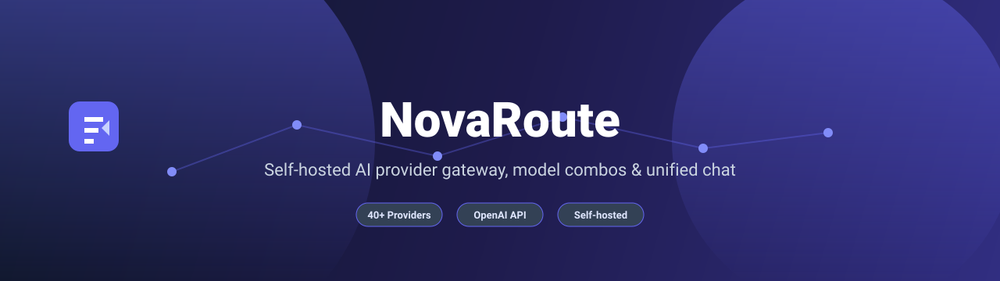

<div align="center">
<div align="right">
  <a href="../README.md">English</a> | <a href="../README.fa.md">فارسی</a>
</div>



**NovaRoute – 고급 AI 프로바이더 및 채팅 플랫폼**

AI 프로바이더(API, CLI, OAuth, Cookie)를 관리하고, 모델 콤보를 구축하며, 모든 모델을 한 곳에서 채팅할 수 있는 강력한 셀프 호스팅 플랫폼.

[](../LICENSE)
[](https://github.com/IRNova/NovaRoute)
</div>

---

## 🚀 원클릭 설치

새 Linux 서버에서 실행합니다 (Ubuntu/Debian, RHEL/CentOS/Fedora 또는 호환 가능):

```bash
curl -fsSL https://raw.githubusercontent.com/IRNova/NovaRoute/main/install.sh | sudo bash
```

설치 프로그램은 다음을 수행합니다:

1. Node.js가 없으면 설치합니다.
2. 이 리포지토리를 `/opt/novaroute`에 클론합니다.
3. 의존성을 설치하고 프로덕션 번들을 빌드합니다.
4. 격리된 Linux 사용자 `novaroute`와 데이터 디렉토리 `/var/lib/novaroute`를 생성합니다.
5. 랜덤 시크릿으로 보안 `.env` 파일을 생성합니다.
6. `novaroute`라는 systemd 서비스를 설치하고 시작합니다.
7. 대시보드의 모든 무료 인증 불필요 프로바이더를 자동 구성하여 즉시 사용할 수 있습니다.

기본 포트는 **20126**입니다 (OmniRoute 충돌을 피하기 위해 선택). 설치 프로그램은 확인 또는 변경을 요청합니다.

설치 후 대시보드를 엽니다:

```text
http://<server-ip>:20126/dashboard
```

설치 로그 끝에 인쇄된 초기 비밀번호를 사용하십시오.

---

## 📋 요구 사항

- `systemd`가 있는 Linux 서버
- `curl`, `git`, `openssl`
- Node.js **20+** (없으면 자동 설치)
- 최소 1 GB RAM (2 GB 권장)
- 2 GB 여유 디스크 공간
- systemd 및 `/opt` 설치용 root/sudo 액세스

---

## 🌐 API

NovaRoute는 다음 위치에서 OpenAI 호환 엔드포인트를 노출합니다:

```text
http://<server-ip>:20126/v1
```

AI 클라이언트(Claude Code, Cursor, Cline, Codex 등)를 구성합니다:

- **베이스 URL:** `http://<server-ip>:20126/v1`
- **API 키:** 대시보드의 **설정 → API 키**에서 생성
- **모델:** 대시보드에 표시되는 프로바이더/모델 별칭 사용

---

## 📄 라이선스

NovaRoute는 [MIT 라이선스](../LICENSE)에 따라 배포됩니다.
